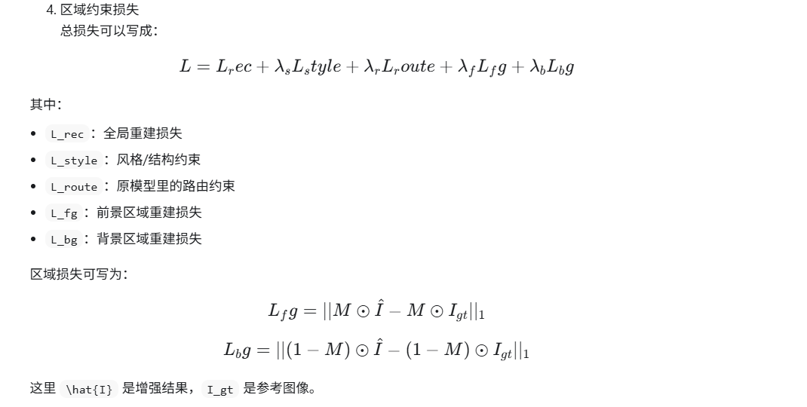

# SAM 引入后的创新点整理

## 1. 是否可以作为创新点

可以作为创新点，但不建议只表述为“在 Clip-UIE 中加入了 SAM”。  
如果仅写成“引入 SAM 对水下图像做前景/背景分离后再增强”，创新性通常偏弱，更像是合理的工程改进。

更合适的表述方式是：

- 提出一种基于 SAM 结构先验的水下图像前景-背景解耦增强方法。
- 利用 SAM 提供的区域掩码，将水下图像划分为前景区域与背景区域，实现差异化增强。
- 设计区域约束损失与融合机制，在提升主体细节恢复能力的同时保持背景区域的自然性。

核心思想不是“用了 SAM”，而是“利用 SAM 提供的结构先验，设计适合水下图像增强任务的区域解耦增强框架”。

## 2. 创新点表述建议

### 2.1 简洁版

本文提出一种基于 SAM 结构先验的水下图像前景-背景解耦增强方法，通过显式区域分离与差异化恢复，提升主体细节和整体自然度。

### 2.2 完整版

1. 提出一种基于 SAM 结构先验的水下图像前景-背景解耦增强方法。该方法利用 SAM 提供的区域掩码，将水下图像中的主体区域与背景区域显式分离，从而缓解传统统一增强策略对不同退化区域处理不一致的问题。

2. 设计区域感知增强机制，将前景区域和背景区域作为两类具有不同退化特性的子区域进行差异化恢复。前景更关注目标纹理、边缘和细节恢复，背景更关注颜色偏移校正、散射抑制与整体自然度保持。

3. 引入区域约束损失与融合策略，在全局重建目标之外增加前景/背景局部一致性监督，使模型在提升主体可见性的同时，避免背景区域出现过增强、伪影和色彩失真。

### 2.3 一句话版

本文提出一种 SAM 引导的前景-背景解耦水下图像增强框架，通过结构先验掩码、区域差异化增强和区域约束损失，实现主体细节恢复与背景自然性保持的协同优化。

## 3. 方法设计思路

### 3.1 方法整体框架

方法可以按照以下四个部分进行描述：

1. SAM 先验生成模块  
   输入退化水下图像，使用 SAM 自动生成软掩码，得到前景概率图 `M`。其中 `M` 表示潜在主体区域，`1 - M` 表示背景区域。

2. 区域引导特征建模  
   将软掩码作为条件先验输入增强网络，使模型在编码阶段获得区域位置信息，从而感知哪些区域更可能是主体，哪些区域更可能是背景。

3. 区域差异化增强  
   对前景区域侧重纹理恢复、对比度提升和边缘保持；对背景区域侧重颜色补偿、散射抑制和整体自然过渡。

4. 区域约束损失  
   在全局重建损失基础上，增加前景和背景的局部一致性监督，使增强结果在不同区域上都具备更好的表现。

### 3.2 当前代码对应的方法阶段

目前已经完成的是：

- SAM 掩码离线生成
- 掩码作为模型条件输入
- 前景/背景区域损失约束

因此当前版本更适合描述为：

“基于 SAM 先验引导和区域损失约束的水下图像增强框架”

如果后续进一步加入前景分支和背景分支双路增强，则可以升级为：

“基于 SAM 先验的前景-背景双分支解耦增强框架”

## 4. 论文中的动机描述

下面这段内容可以直接作为方法动机或引言中的问题分析：

水下图像退化具有明显的区域不均匀性。前景主体通常承载主要语义信息，更依赖纹理和边缘恢复；背景区域则受散射、颜色偏移和低对比度影响更明显，更需要全局颜色校正与自然度约束。传统统一增强方法难以同时兼顾主体清晰度与背景自然性，因此本文引入结构先验，对前景与背景进行差异化建模与增强。

## 5. 损失函数设计建议

总损失可以表示为：

```math
L = L_{rec} + \lambda_s L_{style} + \lambda_r L_{route} + \lambda_f L_{fg} + \lambda_b L_{bg}
```

其中：

- `L_rec`：全局重建损失
- `L_style`：风格或结构一致性损失
- `L_route`：原始 Clip-UIE 中的路由约束损失
- `L_fg`：前景区域重建损失
- `L_bg`：背景区域重建损失

前景区域损失可表示为：

```math
L_{fg} = \| M \odot \hat{I} - M \odot I_{gt} \|_1
```

背景区域损失可表示为：

```math
L_{bg} = \| (1 - M) \odot \hat{I} - (1 - M) \odot I_{gt} \|_1
```

其中：

- `\hat{I}` 表示增强输出图像
- `I_{gt}` 表示参考清晰图像
- `M` 表示前景软掩码
- `\odot` 表示逐元素乘法


## 6. 方法命名建议

可以考虑以下命名方式：

- `SAM-UIE`
- `SAM-ClipUIE`
- `Region-Guided ClipUIE`
- `FG-BG Decoupled ClipUIE`
- `SFGD-UIE`

如果希望更贴近中文论文写法，建议使用：

“基于 SAM 先验的前景-背景解耦水下图像增强方法”

## 7. 实验设计建议

### 7.1 主对比实验

建议与以下方法进行比较：

- 原始 Clip-UIE baseline
- 若干常见水下图像增强方法
- 引入 SAM 的改进方法

评价指标建议包括：

- `PSNR`
- `SSIM`
- `UIQM`
- `UCIQE`

### 7.2 消融实验

建议设计如下消融对比：

- Baseline
- Baseline + SAM mask input
- Baseline + 区域损失
- Baseline + SAM mask + 区域损失
- Baseline + SAM mask + 区域损失 + 双分支融合

这样可以验证：

- SAM 先验是否有效
- 区域损失是否有效
- 多模块组合是否带来进一步收益

### 7.3 掩码策略实验

建议进一步分析掩码设计的影响，例如：

- 不使用 mask
- 使用硬掩码
- 使用软掩码
- 不同 `top-k`
- 不同 `max_area_ratio`

这样可以证明模型提升并不是简单来自额外输入，而是与你设计的掩码策略有关。

### 7.4 可视化实验

建议展示以下内容：

- 输入图像
- SAM 掩码
- Baseline 输出
- 本文方法输出
- 局部放大对比图

重点分析：

- 主体边缘是否更清晰
- 主体纹理是否恢复更充分
- 背景颜色是否更自然
- 是否减少了过增强和色偏问题

## 8. 论文中的贡献点写法

如果论文中需要单独列出 `Contributions`，可以写成：

1. 提出一种基于 SAM 结构先验的水下图像增强框架，通过显式前景-背景分离提升区域建模能力。

2. 设计区域差异化增强与区域约束损失，使网络能够兼顾前景主体细节恢复与背景区域自然性保持。

3. 在 UIEB 等数据集上的实验表明，所提方法在客观指标和主观视觉质量上均优于基线方法，并通过消融实验验证了各组成模块的有效性。

## 9. 当前工作定位

结合当前已经完成的代码实现，现阶段最适合的工作定位是：

“初步实现了基于 SAM 先验引导和区域损失约束的水下图像增强框架。”

如果后续继续扩展为前景分支与背景分支双路增强结构，则整体方法完整性和创新强度会进一步提高。

## 10. 后续可继续增强的方向

为了让该创新点更强，后续可以继续加入以下设计：

- 前景分支和背景分支双路增强网络
- 基于掩码的自适应融合模块
- 面向区域的注意力机制
- 前景区域纹理增强约束
- 背景区域颜色一致性约束

这些内容能够让“基于 SAM 先验的区域解耦增强”从一个改进点，进一步提升为更加完整的方法框架。
